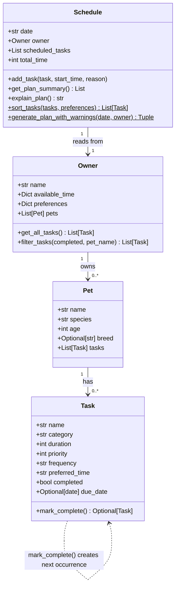

# PawPal+ Final UML Diagram

Paste the Mermaid code below into [https://mermaid.live](https://mermaid.live) and export as `uml_final.png`.

### Relationships

| Relationship | Description |
|---|---|
| `Owner → Pet` | One owner manages many pets |
| `Pet → Task` | One pet has many tasks |
| `Schedule → Owner` | Schedule reads pets and preferences from the owner |
| `Task ⟶ Task` | `mark_complete()` returns a new Task for the next recurrence |

### Notes on `$` (static/class methods)

- `sort_tasks` is a `@staticmethod` — called as `Schedule.sort_tasks(tasks, prefs)`
- `generate_plan_with_warnings` is a `@classmethod` — called as `Schedule.generate_plan_with_warnings(date, owner)`
